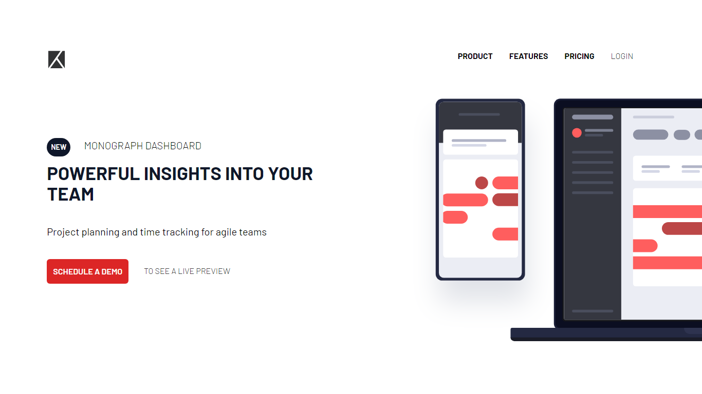

<h1>Project tracking intro component solution</h1>

This is my solution to the [Project tracking intro component challenge on Frontend Mentor](https://www.frontendmentor.io/challenges/project-tracking-intro-component-5d289097500fcb331a67d80e).

</img>

- Solution URL: [Frontend Mentor](https://www.frontendmentor.io/solutions/four-card-section-dvqlujxPdW)
- Live Site URL: [GitHub](https://kalebemax.github.io/four-card-feature-section-master/)

<h2>Built with</h2>

- Semantic HTML5 markup
- CSS custom properties
- Tailwind Css
- Javascript
- Flexbox
- Mobile-first workflow
